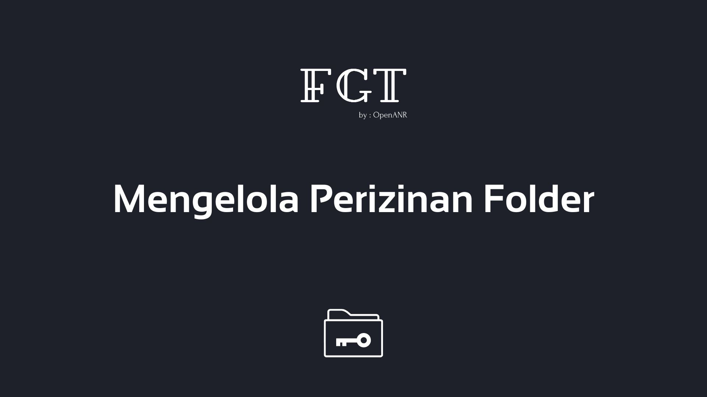

# Mengelola Perizinan di Linux
_Panduan mengelola perizinan folder atau file di Linux._

Dalam sistem operasi Linux, keamanan dan manajemen hak akses sangatlah ketat. Setiap file dan folder memiliki aturan perizinan (*permissions*) dan kepemilikan (*ownership*) masing-masing. Panduan ini akan menjelaskan cara memahami, memeriksa, serta mengelola perizinan tersebut menggunakan perintah command line (CLI).

## Daftar Panduan

Berikut adalah panduan yang tersedia dalam kategori ini:

*   **[Penggunaan Chown dan Chmod](penggunaan-chown-dan-chmod.md)**
    Panduan lengkap penggunaan dan pengelolaan perizinan di dalam folder Linux menggunakan `chmod` dan `chown`.
