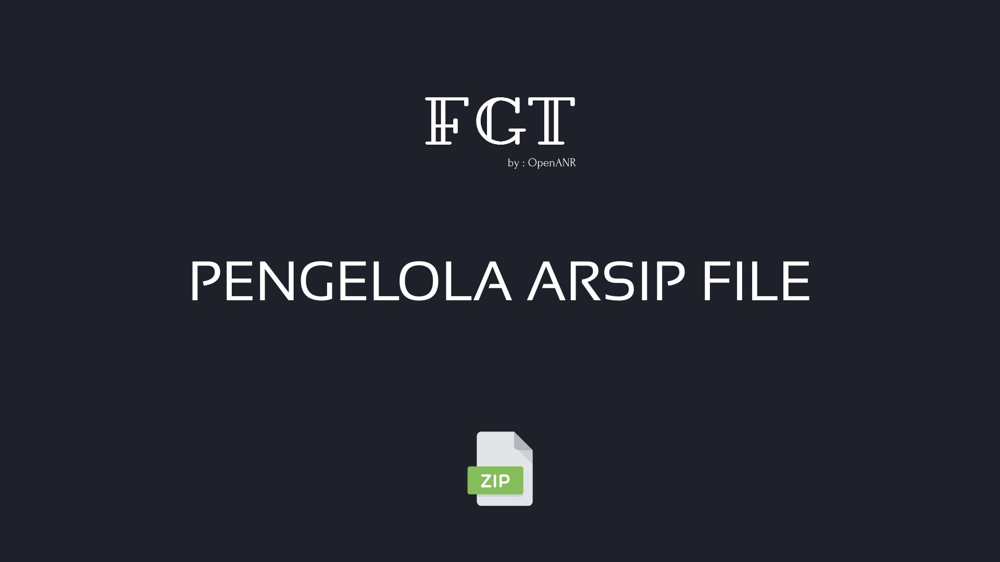

# Pengelola Arsip File
_Panduan mengelola dan mengompresi arsip file di Linux._

Modul ini membahas tentang cara mengelola arsip file di sistem operasi Linux menggunakan berbagai utilitas command line (CLI). Anda akan mempelajari teknik penggabungan file, kompresi, ekstraksi, serta opsi-opsi yang umum digunakan.

## Daftar Panduan

Berikut adalah panduan yang tersedia dalam kategori ini:

*   **[Perintah TAR dan Fungsinya](perintah-tar.md)**
    Panduan lengkap penggunaan utilitas `tar` untuk membuat arsip biasa, kompresi menggunakan algoritma Gzip, Bzip2, dan Xz, serta cara mengekstrak kembali file arsip.

*   **[Perintah ZIP dan UNZIP](perintah-zip-unzip.md)**
    Panduan lengkap penggunaan utilitas `zip` dan `unzip` untuk pengarsipan dan pengekstrakan file.
