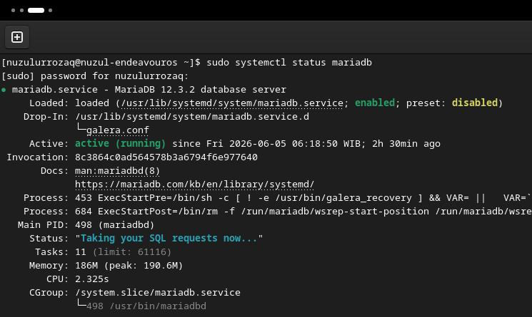

# CARA INSTALL MARIADB DI ARCH LINUX
_By : Ahmad Nuzulur Rozaq + Gemini AI_

**MariaDB** adalah sistem manajemen basis data relasional (RDBMS) yang bersifat open-source dan sangat populer.

## Install Paket MariaDB

Berikut adalah langkah-langkah untuk menginstall MariaDB di Arch Linux :

1. Pertama, pastikan ekstensi yang dibutuhkan oleh MariaDB sudah aktif di PHP :
2. Kemudian install paket MariaDB dengan mengetikkan perintah berikut :

```bash
sudo pacman -S mariadb
```
## Konfigurasi MariaDB

### 1. Setup Direktori Data MariaDB

Setelah instalasi berhasil, langkah selanjutnya adalah melakukan konfigurasi MariaDB agar berjalan optimal. Berikut adalah langkah-langkah yang perlu dilakukan :

1. Inisialisasi direktori data MariaDB untuk menginstall database:

```bash
sudo mysql_install_db --user=mysql --basedir=/usr --datadir=/var/lib/mysql
```
2. Setelah berhasil, aktifkan dan jalankan layanan MariaDB:

```bash
sudo systemctl enable --now mariadb
```
3. Cek status layanan MariaDB:

```bash
sudo systemctl status mariadb
```
Jika statusnya `active (running)` berarti berhasil seperti contoh gambar di bawah ini:



4. Amankan instalasi MariaDB, jika service sudah berhasil berjalan, jalankan skrip keamanan bawaan untuk mengatur password root database:

```bash
sudo mysql_secure_installation
```
_**Catatan :** Penjelasan lengkap mengenai skrip `sudo mysql_secure_installation` ada pada sub bab di bawah ini._

### 2. Konfigurasi `mysql_secure_installation`

Berikut adalah penjelasan lengkap mengenai skrip `sudo mysql_secure_installation`:

1. `Enter current password for root?` (Masukkan Kata Sandi Root Saat Ini?) : 
    - **Instruksi** : Skrip akan meminta password root database yang saat ini digunakan. 
    - **Tindakan** : Jika Anda baru pertama kali menginstal database dan belum pernah mengatur password, langsung tekan Enter (kosong).

2. `Switch to unix_socket authentication?` (Apakah Anda ingin beralih ke Otentikasi unix_socket?) : 
    - **Instruksi** : Pertanyaan apakah Anda ingin menggunakan plugin unix_socket untuk login sebagai root.
    - **Tindakan** : Tekan **Y** jika Anda ingin agar user `root` Linux lokal bisa langsung masuk ke database tanpa mengetik password (sangat aman untuk server lokal). Tekan **n** jika Anda lebih memilih sistem password tradisional.

3. `Change the root password?` (Ubah Kata Sandi Root?) : 
    - **Instruksi** : Pertanyaan untuk menetapkan password baru bagi pengguna akun administrator (`root`) database. 
    - **Tindakan** : Tekan **Y**, lalu ketik password baru yang kuat sebanyak dua kali. Catat password ini agar tidak lupa.

4. `Remove anonymous users?` (Hapus Pengguna Anonim?) : 
    - **Instruksi** : Secara default, instalasi menyertakan pengguna anonim agar siapa saja bisa mencoba database tanpa akun. 
    - **Tindakan** : Tekan **Y** untuk menghapus akun anonim demi mencegah akses tidak sah.

5. `Disallow root login remotely?` (Apakah Login Root dari Jarak Jauh Tidak Diizinkan?) : 
    - **Instruksi** : Menentukan apakah user `root` hanya boleh login dari komputer lokal (`localhost`) atau dari komputer mana saja di jaringan. 
    - **Tindakan** : Tekan **Y** jika Anda hanya akan menggunakan database di komputer lokal ini (paling aman). Tekan **n** jika Anda perlu mengakses MariaDB sebagai root dari komputer lain.

6. `Remove test database and access to it?` (Hapus Database Uji Coba dan Akses ke Database Uji Coba?) : 
    - **Instruksi** : Instalasi MariaDB biasanya menyertakan database sampel bernama `test` yang bisa diakses oleh siapa saja. 
    - **Tindakan** : Tekan **Y** untuk menghapus database `test` tersebut demi alasan keamanan.

7. `Reload privilege tables now?` (Apakah Tabel Hak Akses Perlu Dimuat Ulang Sekarang?) : 
    - **Instruksi** : Meminta server untuk segera menerapkan semua perubahan hak akses (privileges) yang baru saja dibuat. 
    - **Tindakan** : Tekan **Y** untuk mengaktifkan perubahan hak akses secara instan.

### 3. Membuat User Baru di MariaDB
Jika Anda tidak ingin menggunakan user `root` untuk mengakses database (karena alasan keamanan), Anda bisa membuat user baru dengan hak akses seluruh isi database. 

Berikut langkah-langkahnya:
1. Login ke MariaDB sebagai root:
```bash
sudo mariadb
```
2. Buat user baru:
```sql
CREATE USER 'nama_user'@'localhost' IDENTIFIED BY 'password';
```
3. Berikan hak akses ke user baru:
```sql
GRANT ALL PRIVILEGES ON *.* TO 'nama_user'@'localhost' WITH GRANT OPTION;
```
4. Simpan perubahan hak akses:
```sql
FLUSH PRIVILEGES;
```
5. Keluar dari MariaDB:
```sql
EXIT;
```
6. Coba login menggunakan user yang baru dibuat:
```bash
mariadb -u nama_user -p
```
_(Tekan Enter, lalu ketikkan password yang baru saja Anda buat)._
