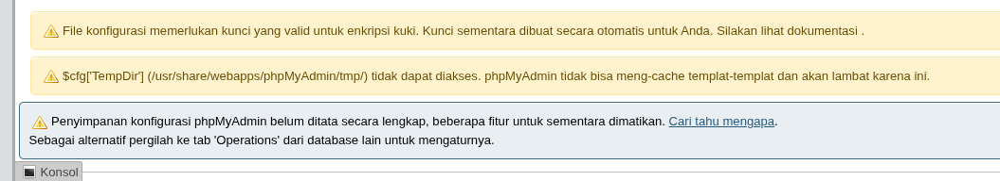
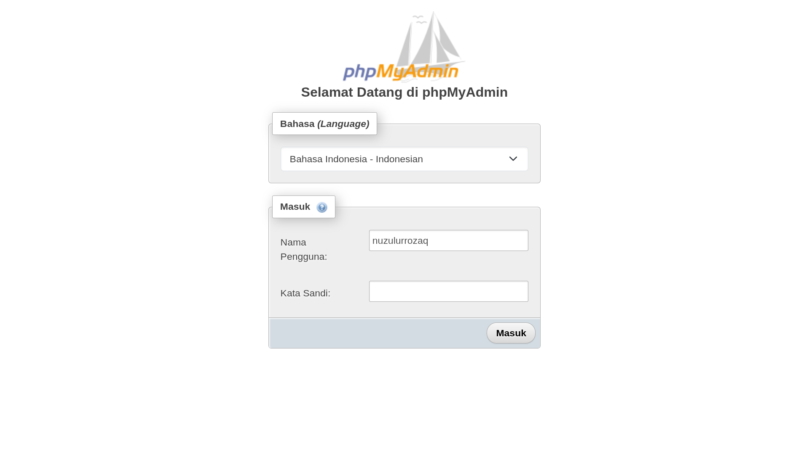
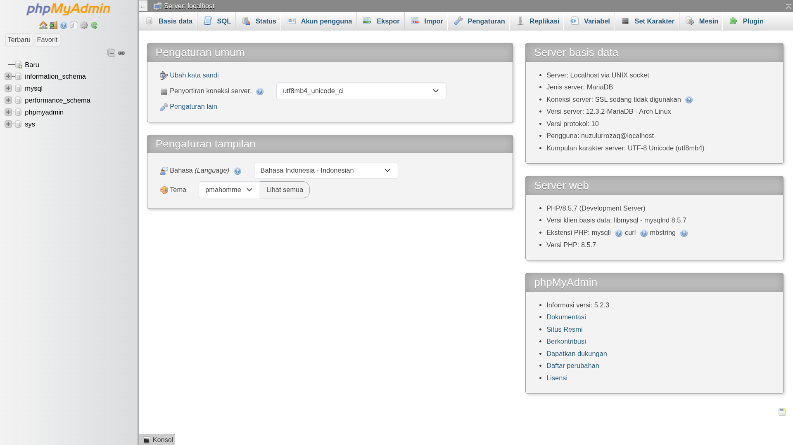

# CARA INSTALL PHPMYADMIN DI ARCH LINUX
_By : Ahmad Nuzulur Rozaq + Gemini AI_

**phpMyAdmin** merupakan aplikasi web berbasis PHP yang digunakan untuk mengelola basis data MySQL atau MariaDB. **phpMyAdmin** biasanya digunakan untuk membantu para pengembang web dalam mengelola basis data MySQL atau MariaDB.

## Install Paket phpMyAdmin

Berikut langkah-langkah menginstall phpMyAdmin di Arch Linux:

1. Pertama pastikan sudah menginstall MariaDB dan PHP
2. Install `phpMyAdmin` dengan mengetikkan perintah berikut :

```bash
sudo pacman -S phpmyadmin
```

## Mengatur Konfigurasi phpMyAdmin
Setelah instalasi berhasil, jangan lupa untuk mengkonfigurasi phpMyAdmin agar tidak muncul pesan warning seperti pada gambar di bawah ini :



### 1. Konfigurasi blowfish Secret
**phpMyAdmin** membutuhkan kunci rahasia sepanjang 32 karakter untuk mengenkripsi cookie sesi Anda agar aman.

Langkah-langkah untuk menghilangkan pesan warning tersebut adalah sebagai berikut :

1. Pertama kalian buka file konfigurasi **phpMyAdmin** dengan menggunakan editor `nano` sebagai berikut :

```bash
sudo nano /etc/phpmyadmin/config.inc.php
```
2. Setelah editor `nano` terbuka, Cari baris yang mengandung tulisan `$cfg['blowfish_secret']`.
3. Isi tanda kutip kosong tersebut dengan 32 karakter acak (bisa kombinasi huruf dan angka bebas). Contohnya menjadi seperti ini:

```PHP
$cfg['blowfish_secret'] = 'a1b2c3d4e5f6g7h8i9j0k1l2m3n4o5p6';
```
4. Simpan file tersebut (jika menggunakan nano, tekan `Ctrl+O`, `Enter`, lalu `Ctrl+X` untuk keluar).

### 2. Mengatur Folder Sementara (Temporary Folder)
**phpMyAdmin** membutuhkan folder sementara (`tmp`) untuk menyimpan cache agar kerjanya lebih cepat, tetapi folder tersebut belum ada atau tidak memiliki izin akses yang tepat.

Langkah-langkah untuk menghilangkan pesan warning tersebut adalah sebagai berikut :

1. Pertama buat folder sementara `tmp` tersebut di dalam direktori phpMyAdmin:

```bash
sudo mkdir -p /usr/share/webapps/phpMyAdmin/tmp
```
2. Selanjutnya, atur kepemilikan folder `tmp` kepada user `http` agar aman digunakan:

```bash
sudo chown -R http:http /usr/share/webapps/phpMyAdmin/tmp
```
3. Terakhir, atur hak akses folder `tmp` tersebut agar aman digunakan:

```bash
sudo chmod 777 /usr/share/webapps/phpMyAdmin/tmp
```

### 3. Mengatur Konfigurasi Penyimpanan (Configuration Storage)
Peringatan ini muncul karena database khusus bernama **phpmyadmin** (yang digunakan untuk menyimpan bookmark, riwayat SQL, dan relasi tabel) belum dibuat di dalam MariaDB Anda.

Langkah-langkah untuk menghilangkan pesan warning tersebut adalah sebagai berikut :

1. Jalankan perintah ini di terminal untuk mengimpor file SQL bawaannya ke database MariaDB (ganti `root` dengan username Anda jika Anda menggunakan user lain):

```bash
mariadb -u root -p < /usr/share/webapps/phpMyAdmin/sql/create_tables.sql
```
2. Buka kembali file konfigurasi **phpMyAdmin**:

```bash
sudo nano /etc/webapps/phpmyadmin/config.inc.php
```
3. Gulir ke bawah dan cari bagian `/* Storage database and tables */`. Hapus tanda `//` di awal baris pada pengaturan-pengaturan tersebut agar aktif. Bentuknya akan menjadi seperti ini:

```PHP
$cfg['Servers'][$i]['pmadb'] = 'phpmyadmin';
$cfg['Servers'][$i]['bookmarktable'] = 'pma__bookmark';
$cfg['Servers'][$i]['relation'] = 'pma__relation';
$cfg['Servers'][$i]['table_info'] = 'pma__table_info';
$cfg['Servers'][$i]['table_coords'] = 'pma__table_coords';
$cfg['Servers'][$i]['pdf_pages'] = 'pma__pdf_pages';
$cfg['Servers'][$i]['column_info'] = 'pma__column_info';
$cfg['Servers'][$i]['history'] = 'pma__history';
$cfg['Servers'][$i]['table_uiprefs'] = 'pma__table_uiprefs';
$cfg['Servers'][$i]['tracking'] = 'pma__tracking';
$cfg['Servers'][$i]['userconfig'] = 'pma__userconfig';
$cfg['Servers'][$i]['recent'] = 'pma__recent';
$cfg['Servers'][$i]['favorite'] = 'pma__favorite';
$cfg['Servers'][$i]['users'] = 'pma__users';
$cfg['Servers'][$i]['usergroups'] = 'pma__usergroups';
$cfg['Servers'][$i]['navigationhiding'] = 'pma__navigationhiding';
$cfg['Servers'][$i]['savedsearches'] = 'pma__savedsearches';
$cfg['Servers'][$i]['central_columns'] = 'pma__central_columns';
$cfg['Servers'][$i]['designer_settings'] = 'pma__designer_settings';
$cfg['Servers'][$i]['export_templates'] = 'pma__export_templates';
```
4. Simpan file tersebut (`Ctrl+O`, `Enter`, `Ctrl+X`).

### 4. Langkah Terakhir
Setelah melakukan ketiga hal di atas, silakan Logout dari **phpMyAdmin** Anda, lalu Login kembali (atau cukup refresh halamannya). Semua peringatan kuning tersebut seharusnya sudah hilang!

## Cara Mengakses phpMyAdmin
Setelah konfigurasi selesai, Anda dapat mengakses **phpMyAdmin** dengan mengetikkan alamat berikut :

1. Jalankan perintah berikut :

```bash
php -S localhost:8080 -t /usr/share/webapps/phpMyAdmin
```

2. Buka browser dan akses **phpMyAdmin** dengan mengetikkan alamat berikut :

```
http://localhost:8080
```
3. Login menggunakan username dan password **MariaDB** yang sudah Anda buat sebelumnya. Contohnya seperti pada gambar di bawah ini:



4. Jika login berhasil, maka akan masuk ke halaman dashboard **phpMyAdmin**:



